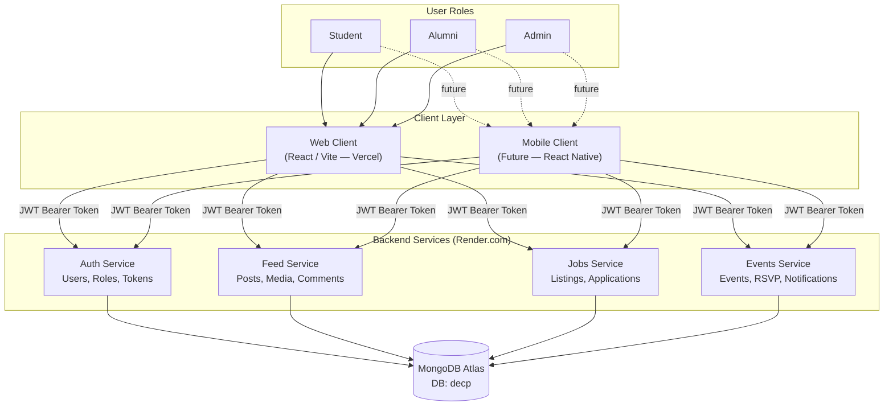
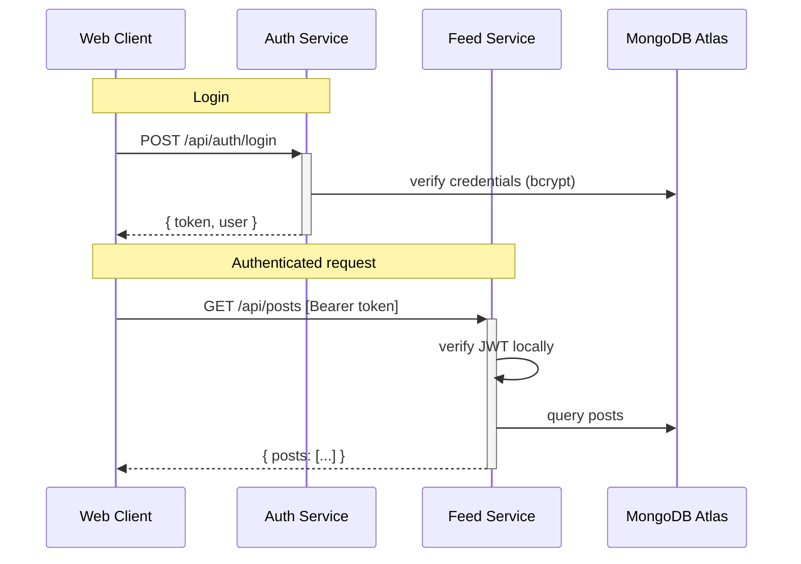
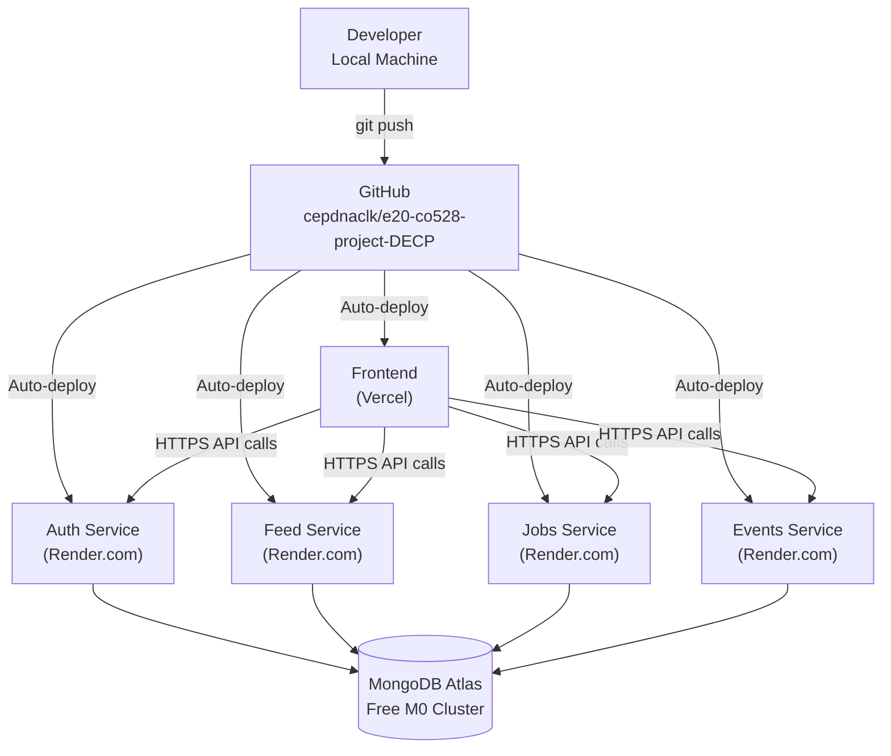

# Department Engagement & Career Platform (DECP)
### CO528 — Applied Software Engineering | Project Report

---

**GitHub Repository:** https://github.com/cepdnaclk/e20-co528-project-DECP  
**Live Frontend:** https://decp-frontend-git-main-e20189-4691s-projects.vercel.app  
**Backend Services:** Deployed on Render.com

---

## Team Members

| Name | Reg. No. | Role |
|---|---|---|
| Karunarathne K.N.P. | E/20/189 | Enterprise Architect / DevOps Architect |
| N.K.D.P. Jayawardena | E/20/178 | Solution Architect / Security Architect |
| N.R.P. Gunathilake | E/20/122 | Application Architect |

---

## 1. Project Overview

DECP is a department-focused platform connecting students, alumni, and administrators. It enables community feed, job/internship discovery, event participation, and role-based access control. The system is built as a **Service-Oriented Architecture (SOA)** — four independent backend microservices, each with its own database collections, consumed by a React web client via REST APIs.

| Phase | Feature | Status |
|---|---|---|
| Phase 1 | User Management & Authentication | Complete |
| Phase 2 | Feed & Media Posts | Complete |
| Phase 3 | Jobs & Internships | Complete |
| Phase 4 | Events, RSVP & Notifications | Complete |
| Phase 5 | Web Client (React + Vite) | Complete |
| Phase 6 | Cloud Deployment | Complete |

---

## 2. Architecture

### 2.1 Enterprise Architecture

The diagram below shows how the three user roles interact with the system through the web client, passing through JWT authentication to reach the four backend services, all backed by a shared MongoDB Atlas database.



**User roles and capabilities:**

| Actor | Capabilities |
|---|---|
| Student | Register, post to feed, apply for jobs, RSVP for events |
| Alumni | All student capabilities + post jobs, create events |
| Admin | Full access — delete any content, view all users |

---

### 2.2 Service-Oriented Architecture (SOA)

Each service is independently deployable, owns its own REST API, and does **not call other services**. Authentication is handled offline — all services share the same `JWT_SECRET` and verify tokens locally, with no network hop to Auth service.



**Service endpoints at a glance:**

| Service | Base URL | Key Endpoints |
|---|---|---|
| Auth | `decp-backend-auth.onrender.com` | POST `/auth/register`, POST `/auth/login`, GET `/users/me` |
| Feed | `decp-feed.onrender.com` | GET/POST `/posts`, POST `/posts/:id/like`, POST `/posts/:id/comments` |
| Jobs | `decp-backend-jobs.onrender.com` | GET/POST `/jobs`, POST `/jobs/:id/apply` |
| Events | `decp-backend-events.onrender.com` | GET/POST `/events`, POST `/events/:id/rsvp`, GET `/notifications` |

---

### 2.3 Cloud Deployment Architecture



---

## 3. Implementation

### 3.1 Technology Stack

| Layer | Technology |
|---|---|
| Backend runtime | Node.js 20 LTS + Express.js |
| Database | MongoDB Atlas + Mongoose |
| Authentication | JWT (jsonwebtoken) + bcryptjs |
| File uploads | multer (local disk storage) |
| Frontend | React 18 + Vite |
| HTTP client | axios |
| Routing | React Router v6 |

### 3.2 Frontend Structure

The web client is a single-page application with a clean separation between API calls and UI:

```
frontend-web/src/
├── api/            ← One file per service (authApi, feedApi, jobsApi, eventsApi)
│   └── config.js  ← All backend URLs from VITE_* env vars
├── context/        ← AuthContext (global user state + localStorage)
├── components/     ← Navbar, ProtectedRoute
└── pages/          ← LoginPage, RegisterPage, FeedPage, JobsPage, EventsPage
```

All backend URLs are centralised in `api/config.js` using `VITE_*` environment variables. Changing a backend URL only requires updating one environment variable in Vercel — no page-level code changes needed.

### 3.3 Database Collections

The four services share one MongoDB database (`decp`) but own separate collections:

| Service | Collections |
|---|---|
| Auth | `users` |
| Feed | `posts`, `comments` |
| Jobs | `jobs`, `applications` |
| Events | `events`, `rsvps`, `notifications` |

---

## 4. Design Decisions

### 4.1 SOA over a Monolith

Each service is deployed, scaled, and updated independently. A bug in the Jobs service does not affect Feed or Events. Individual services can be redeployed without touching the rest of the system — essential for team development and future growth.

### 4.2 MongoDB over a Relational Database

Social content (posts, comments, events) has a variable shape that fits naturally into a document model. Mongoose schemas still enforce validation while allowing flexibility. MongoDB Atlas M0 is free and can scale to paid tiers without schema migrations.

### 4.3 Shared JWT Secret vs. Centralised Auth

Rather than routing every request through an Auth server (adding latency and a single point of failure), all services share a `JWT_SECRET` environment variable and verify tokens locally. This keeps each service fully self-contained.

### 4.4 CORS — Regex Pattern Instead of Exact URL

Vercel generates multiple URLs per project (production, git-branch, per-deploy preview). Instead of maintaining a list, all services use:

```js
const VERCEL_PATTERN = /\.vercel\.app$/;
// allows any *.vercel.app origin automatically
```

This eliminates the need to update environment variables every time Vercel creates a new preview URL.

---

## 5. Cloud Deployment

### 5.1 Services

| Service | Platform | Trigger |
|---|---|---|
| Auth, Feed, Jobs, Events | Render.com (Free Web Service) | Git push to `main` |
| Frontend | Vercel (Hobby) | Git push to `main` |
| Database | MongoDB Atlas (M0 Free) | Always-on managed cluster |

### 5.2 Environment Variables

**Each Render service requires:**

| Variable | Purpose |
|---|---|
| `MONGO_URI` | MongoDB Atlas connection string |
| `JWT_SECRET` | Shared across all 4 services (must be identical) |
| `JWT_EXPIRES_IN` | `7d` |

**Vercel frontend requires:**

| Variable | Value |
|---|---|
| `VITE_AUTH_URL` | `https://decp-backend-auth.onrender.com/api` |
| `VITE_FEED_URL` | `https://decp-feed.onrender.com/api` |
| `VITE_JOBS_URL` | `https://decp-backend-jobs.onrender.com/api` |
| `VITE_EVENTS_URL` | `https://decp-backend-events.onrender.com/api` |

### 5.3 Scalability Notes

The current free-tier setup uses a single instance per service and a single MongoDB cluster. To scale:
- **Database:** Upgrade Atlas to M10+ (replica sets, read replicas)
- **Backend:** Render paid tier enables horizontal scaling; or migrate to AWS ECS/Fargate
- **Media:** Replace local `uploads/` with Cloudinary or S3 (current disk is ephemeral on Render)
- **Auth:** Replace shared JWT secret with OAuth2/OpenID Connect for enterprise-grade secret rotation

---
